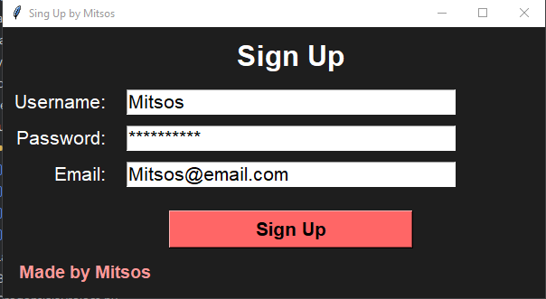
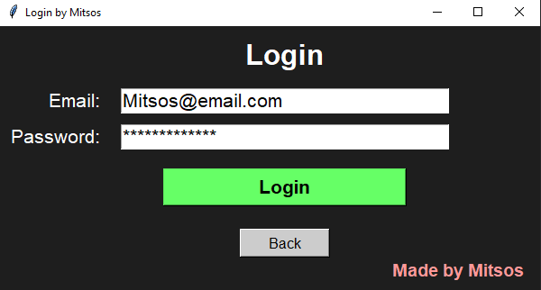

# SingUpLoginPython

A small desktop Sign Up / Login example written with Tkinter (Python GUI).  
This project demonstrates a minimal GUI flow for creating an account (in-memory), validating a password, and logging in. It's intended for learning and prototyping only.

## Features
- Sign Up form (username, email, password)
- Password strength validation (length, uppercase, lowercase, digit, special character)
- Simple Login form (email + password)
- Two-window flow (Sign Up → Login)
- Friendly message boxes for feedback

## Requirements
- Python 3.8+ (Tkinter is included in standard CPython distributions)
- No external packages required

Tested on typical CPython installations where Tkinter is available.

## Running the app
1. Clone the repository:
   ```
   git clone https://github.com/Jimoulis31/SingUpLoginPython.git
   cd SingUpLoginPython
   ```

2. Run the provided script (replace `app.py` below with the actual filename if different):
   ```
   python app.py
   ```
   The GUI window titled "Sing Up by Mitsos" will open. Fill the fields and click "Sign Up". After a successful signup the login window appears.

## How it works (short overview)
- The GUI is built using Tkinter. Two windows are used:
  - `window` — the Sign Up window
  - `loginwindow` — the Login window (initially withdrawn)
- Global variables `saved_user`, `saved_email`, and `saved_pass` temporarily store the created account in memory.
- `passwordcheck(password)` validates the password for:
  - Minimum length (8)
  - At least one uppercase letter, one lowercase letter, one number and one special character
  - Returns `(True, "")` when valid or `(False, reason)` when invalid
- `signup()` runs validation and, on success, stores the credentials in the global variables and switches to the login screen
- `loginin()` checks the entered email and password against the in-memory stored values and shows success/error messages

## Limitations & Security notes (important)
This implementation is explicitly a learning/demo example and is NOT secure for production use:
- Credentials are stored only in memory in plain text (no persistence, no hashing).
- Passwords should never be stored in plain text. Use a secure password hashing algorithm (bcrypt, Argon2) before storing.
- For real apps, persist accounts in a secure database (SQLite, PostgreSQL, etc.) with hashed passwords and proper input sanitization.
- Use TLS (HTTPS) and other standard protections if exposing authentication over a network.
- The app does not implement protections against brute-force attempts, account lockout, email verification, or CSRF.

## Suggested improvements
- Persist accounts to a small database (SQLite) and migrate global variables to a data store.
- Hash passwords using a library such as `bcrypt` or `argon2-cffi`.
- Add email validation (format check) and optionally verify the email address.
- Add a "show password" toggle for usability, and password confirmation on sign up.
- Add unit tests for `passwordcheck` and login/signup flows.

## Screenshots


